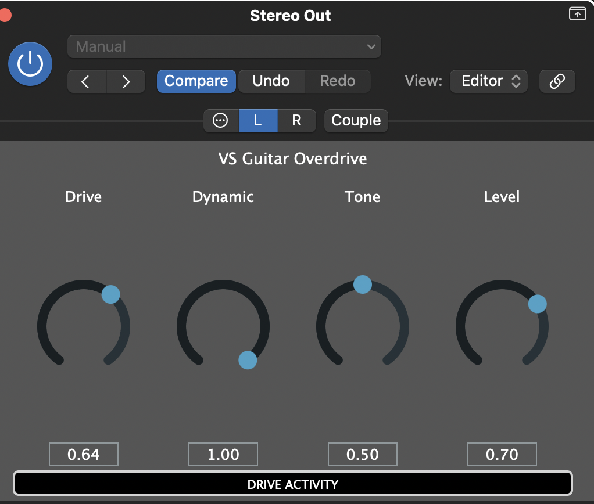

# VS Guitar Overdrive

A simple overdrive plugin I built. It runs as a VST3, Audio Unit, or standalone macOS app. Mostly to experiment with Juce.




## What it does

It adds warm, soft-clipping overdrive to a guitar signal with four controls:

- **Drive** — pushes the signal harder into the clipper
- **Dynamic** — makes the drive follow your playing intensity
- **Tone** — shapes the brightness with a low-pass/high-pass shelf
- **Level** — sets the output volume

The signal chain is:

```
input → envelope detector → dynamic drive → tanh soft clipper → tone filter → output gain
```

With Dynamic at 0, the plugin behaves like a normal overdrive. Turn it up and soft notes stay clean while power chords bloom into distortion.

## Build

Requires macOS, CMake, and Xcode command line tools.

```bash
git clone --recurse-submodules <repo-url>
cd pluginx
cmake -B build -DCMAKE_BUILD_TYPE=Release -DCMAKE_OSX_ARCHITECTURES="arm64;x86_64"
cmake --build build --config Release --parallel 4
```

## Install in Logic Pro

After building, copy the AU into place:

```bash
cp -R build/VSGuitarOverdrive_artefacts/Release/AU/VS\ Guitar\ Overdrive.component \
   ~/Library/Audio/Plug-Ins/Components/
```

Then open Logic Pro, insert the plugin on a guitar track, and look under **Audio Units > VSPlugins > VS Guitar Overdrive**.


## Project files

- `CMakeLists.txt` — JUCE plugin target and metadata
- `src/PluginProcessor.cpp` — DSP and parameter handling
- `src/PluginEditor.cpp` — knob UI
- `BuildGuitarOverdrive.ipynb` — interactive build notebook

## License

MIT
